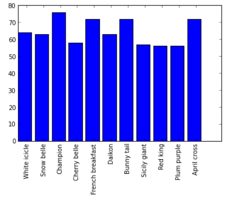
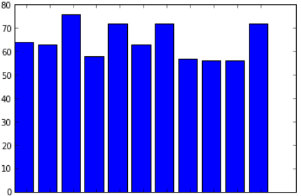
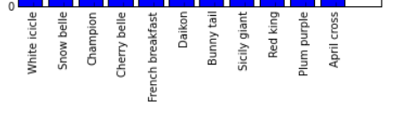

---

layout: ots
title: Creating Charts

---

So far we haven't done anything to really explore IPython Notebook's features, but now we're going to use the library *matplotlib* to create some graphical charts based on our data.

## Inline Charts

If you're using Windows to run IPython Notebook or IPython QtConsole, you'll need to run the following special IPython command (in Notebook, type it into an IPython Notebook cell and then run it):

    %matplotlib inline

... this tells IPython:

* `inline` means that you want charts to be shown "inline style" inside your notebook, not in a separate window.

## Simple Example

Here's an example of a simple chart:

    import matplotlib.pyplot as plt
    vals = [3,2,5,0,1]
    plt.plot(vals)

Try this in Notebook and you'll see the line chart is plotted in the notebook, under the cell.

matplotlib can also output charts in other formats like image files, but being able to edit the code and regenerate the chart inline is one of the nice features of IPython Notebook!

## Using Matplotlib without IPython Notebook

If you want to use matplotlib directly from Python instead of via IPython Notebook, you just need to add one final line to each of your programs:

    plt.show()

This will display a window with the chart you created, and pause the script until you close it.

All the examples in this workshop assume you're using matplotlib with Notebook, so remember this additional line as you work through it (or your program will run, but nothing will happen!)

## Radish Votes

Let's start by using matplotlib to generate a bar graph to display the vote counts from the radish variety program we just wrote.

If you already have the radish program loaded in IPython Notebook, then you should have generated the variable named "counts" which holds a dictionary mapping each radish name to the vote count. Let's use that to plot the vote counts.

You can add this as a new cell in your notebook:

    import matplotlib.pyplot as plt
    import numpy as np
    
    names = []
    votes = []
    # Split the dictionary of name:votes into two lists, one for names and one for vote count
    for radish in counts:
        names.append(radish)
        votes.append(counts[radish])
    
    # The X axis can just be numbered 0,1,2,3...
    x = np.arange(len(counts))
    
    plt.bar(x, votes)
    plt.xticks(x + 0.5, names, rotation=90)

</img>

There's a lot going on here so we'll go through it line by line. Don't be afraid to add `print()` statements, or tweak some of the values, or comment out certain lines (like the xticks line) and rerun the code in order to figure out what's going on here.

    import matplotlib.pyplot as plt
    import numpy as np

We're importing two modules - pyplot is one way to plot graph data with Matplotlib. It's modelled on the way charting works in another popular commercial program, MATLab.

NumPy is a module providing lots of numeric functions for Python.

    names = []
    votes = []
    # Split the dictionary of names->votes into two lists, one holding names and the other holding vote counts
    for radish in counts:
        names.append(radish)
        votes.append(counts[radish])

This loop processes the dictionary into a format that's easy to send to matplotlib - a list of radish names (for the labels on the bars) and a list of vote counts (for the actual graph.)

    # The X axis can just be numbered 0,1,2,3...
    x = np.arange(len(counts))

We create a range of indexes for the X values in the graph, one entry for each entry in the "counts" dictionary (ie `len(counts)`), numbered 0,1,2,3,etc. This will spread out the graph bars evenly across the X axis on the plot.

`np.arange` is a NumPy function like the `range()` function in Python, only the result it produces is a "NumPy array". We'll see why this is useful in a second.

    plt.bar(x, votes)

</img>

`plt.bar()` creates a bar graph, using the "x" values as the X axis positions and the values in the votes array (ie the vote counts) as the height of each bar.

    plt.xticks(x + 0.5, names, rotation=90)

</img>

`plt.xticks()` specifies a range of values to use as labels ("ticks") for the X axis.

`x + 0.5` is a special expression because x is a NumPy array. NumPy arrays have some special capabilities that normal lists or `range()` objects don't have. 

Doing this with a normal range is an error (try it and see):

    x = range(5)
    print(x)
    print(x + 0.5)

However, for [NumPy arrays this means](http://docs.scipy.org/doc/numpy/reference/arrays.ndarray.html#arithmetic-and-comparison-operations) "add 0.5 to all of the numbers in the array."

    x = np.arange(5)
    print(x)
    print(x + 0.5)

Run the above code in IPython Notebook and see what it prints out.

This is what positions the X axis labels in the middle of each bar (0.5 across from the left hand side.) If you remove the `+ 0.5` from the bar graph example then the labels move across to the left hand side of each bar. Try it and see!

Finally, `rotation=90` ensures that the labels are drawn sideways (90 degree angle) not straight. You can experiment with different rotations to create different effects.

## Challenge

There's no label on the Y axis showing that it represents the vote count.

Can you update your bar graph code so it does this? Take a look at the [ylabel() function in the pyplot documentation](http://matplotlib.org/api/pyplot_api.html#matplotlib.pyplot.ylabel).

## Advanced Charting

*matplotlib* and *pyplot* are both extremely powerful charting frameworks.

To take a look at some of what they can do (and the sample Python code that does it), take a moment to browse through the [Matplotlib thumbnail gallery](http://matplotlib.org/gallery.html#pylab_examples) and the [Pyplot tutorial](http://matplotlib.org/users/pyplot_tutorial.html).

Because these tools are fairly complex it can also be helpful to copy and tweak an existing example from the gallery, if you're looking to create a new chart.

(You'll notice the term "pylab" used on some of those pages. Pylab just means Pyplot combined with Numpy.)

## Next Chapter

Time to get into some real world data! The next chapter is [CSV Files](csv.html)
