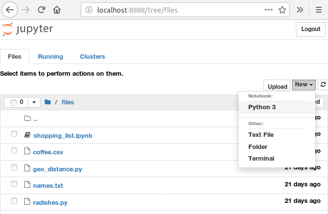

---

layout: ots-jupyter
title: Intro to Anaconda and Jupyter Notebooks

---

This chapter provides a brief introduction to conda, a package management system tailor made for data science, and Jupyter Notebooks, which provide an easy and efficient way analyze data and communicate insights, all in one document. Neither is absolutely necessary to do data science, but as they are both very useful, and very popular, we recommend that you at least give them a try for the duration of this tutorial. 

# Getting started with Conda

### What is conda and why should you use it?

Conda is a package management system made with data scientists in mind.  
The easiest way to install python on your computer is to use *anaconda*. There are many other ways to get python and jupyter but this one is most suitable for beginners. Follow the instructions for your operating system on [https://www.anaconda.com/download/].

With the anaconda package, you get the anaconda navigator, an interactive program that lets you install addons and run programs.

Use the anaconda navigator to install jupyter notebook. Alternatively, you can use the command line and type
```
conda install jupyter notebook
```


# Running Python and Jupyter

After installing Python on your system successfully, you can start the
interactive Python prompt by typing `python` in the command line and
pressing `<Enter>`.  It will show you some context information about
Python similar to this::
    
    Python 3.6.5 (default, Apr  1 2018, 05:46:30) 
    [GCC 7.3.0] on linux
    Type "help", "copyright", "credits" or "license" for more information.
    >>> 

On Windows you can open Python through the Start Menu.

To exit the Python interpreter, press `Ctrl-D`.

To run a program saved in a Python file, you can run it from the command line like so:

    python program.py

On Windows you can run a Python file by double-clicking it.

But there is a much more interactive and fast way to start using python. Launch jupyter notebook from the anaconda navigator or by typing on the command line

```
jupyter notebook
```

It will start the python interpreter in the background and show a browser page that is connected to python. The browser will let you interactively edit and run your python code on your local machine. In this tutorial, we will encourage you to use jupyter-notebooks as it is a tool often used in data science. The python code is the same whether you run it interactively in jupyter or not.

In the jupyter browser window, navigate to a directory where you want to start you python project and press the *new* button on the top right of the web page.




With jupyter and python running, lets recap some of the basic features of the python language. Type the code into a *cell* in jupyter and execute the cell by pressing the *Run* button or *Shift+Return* on your keyboard.

# Python language basics

## Loops

What does this code do?

<div class="jupyter">
```python
for i in [2, 4, 6, 8]:
    print(i)
```

    2
    4
    6
    8
</div>

This code prints the even numbers 2 through 8, one per line.

### Bonus Challenge

Python has a built-in function called `range` that can automatically generate a range of numbers like \[2, 4, 6, 8\]. For example, `range(1,10)` is a sequence of the numbers 1 through 9 (a common but sometimes confusing thing in programming is for the "end" number not to be included in a sequence.)

<div class="jupyter">
```python
for i in range(1,10):
    print(i)
```
</div>

Can you make a `range` equivalent to \[2, 4, 6, 8\]? To get some clues, type `help(range)`. The useful details are near the top. The help utility is available for most python functions and once you know how to read them, they are very useful.


## Variables

You can use variables to manipulate values inside code. What does this code do?

<div class="jupyter">
```python
total = 0
for i in 1, 3, 7:
    total = total + i
print(total)
```

    11
</div>

This code prints the sum of the numbers 1, 3 and 7.

### Bonus Challenge

If you don't want to use a `for` loop for some reason, Python actually has a built-in function called `sum` that lets you bypass it completely. You can get the same result with this:

<div class="jupyter">
```python
print(sum([1,3,7]))
```
</div>

Can you make a one line Python statement that uses both `sum` and `range` to print the sum of the numbers 1 through 10?


## Functions

You can define your own functions with parameters in order to reuse some code again with slight differences. What does this code print?

<div class="jupyter">
```python
def say_hello_to(name):
    print("Hello " + name)

say_hello_to("Miranda")
say_hello_to("Fred")
```

    Hello Miranda
    Hello Fred
</div>

## Conditionals

You can use the 'if' statement to execute some statements only if a condition is true. What does this code print?

<div class="jupyter">

```python
angle = 5
if angle > 0:
    print("Turning clockwise")
elif angle < 0:
    print("Turning anticlockwise")
else:
    print("Not turning at all")

```

    Turning clockwise
</div>


## Next Chapter

All set with Python? On to the next chapter, [Data Structures in Python](data.html)
