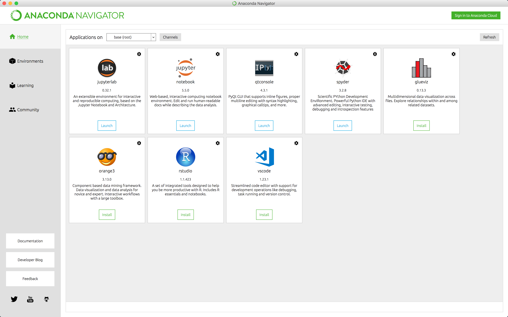
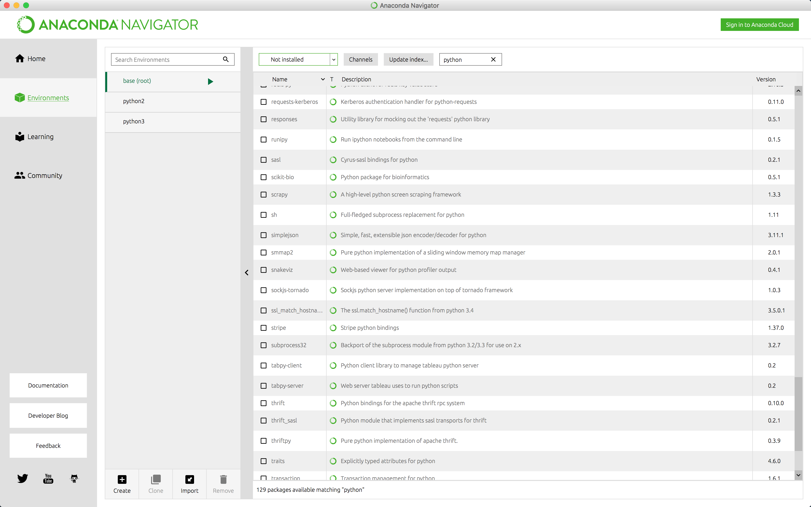

---

layout: ots-jupyter
title: Intro to Anaconda and Jupyter Notebooks

---

This chapter provides a brief introduction to conda, a package management system, and Jupyter Notebooks, which provide an easy and efficient way analyze data and communicate insights, all in one document.

Is it possible to do data science without these tools? Yes, absolutely. Nevertheless, we recommend that you give them a try for a few reasons: First, they are extremely popular, so it is almost certain that you will encounter them at some point in your career. Second, both are tailor made for the data science workflow. And third, they can make your first steps into data science a little easier.  

# Getting started with Conda

### What is conda and why should you use it?

Conda is a package management system made with data scientists in mind, but what are packages? Packages are files containing function definitions and statements that can be imported into an active Python session to perform specific tasks. Many packages have been developed and shared by others that solve problems that we have as data scientists. For example, the NumPy, SciPy, and Pandas packages contain functions and data structures that can help us do things like linear algebra, machine learning, manipulate data frames, and perform time series analyses.

>__Note:__ Packages are typically called [modules](https://docs.python.org/3/tutorial/modules.html) by the Python community. We will continue to refer to "packages" in the present context since the topic at hand is the "package manager" conda. That said, in the other chapters we will maintain the Pythonic norm of calling them "modules".
 
If, for example, we need a random float between 0 and 1, we'll need to import the package `random` and use the function `random()`. Try entering the following into your console:

<div class = 'jupyter'>
```python
import random
random.random()
```
```python
0.9585919464556905
```
</div>

Many packages, like `random`, are bundled with the base Python distribution, but others need to be downloaded and installed, which is why we need a package manager. There are a number of pckage managers. For instance, `pip` is quite popular and is included in all Python binaries starting with Python 3.4. We prefer conda for reasons that will become clear below. 

The best way to get conda is to download the full [Anaconda](https://www.anaconda.com/download/) distribution. Anaconda not only includes many of the most important Python data science packages, it also has a graphical installer and a graphical user interface, the _Anaconda Navigator_, for package management, in case you don't yet feel comfortable using the command line.

Once you've installed Anaconda, run the Anaconda Navigator by clicking it's icon. You should see something like this:



The _Home_ tab contains applications that can be installed – or launched if already installed.If you click on the _Environments_ tab you will see something like this:



Here we see that the user has created two environments on top of the `base (root)`: `python2` and `python3`. To create a new environment `py36` for Python 3.6 take the following steps:

1. Click __Create__ at the bottom of the middle panel.
2. Give your environment a name, e.g. _py36_.
3. Choose Python version 3.6.
4. Click the __Create__ button.

Behind the scenes, conda creates your environment and adds some necessary packages. Alternatively, open a terminal and enter the following:

    conda create -n py36 python=3.6


## Next Chapter

All set with Python? On to the next chapter, [Data Structures in Python](data.html)
