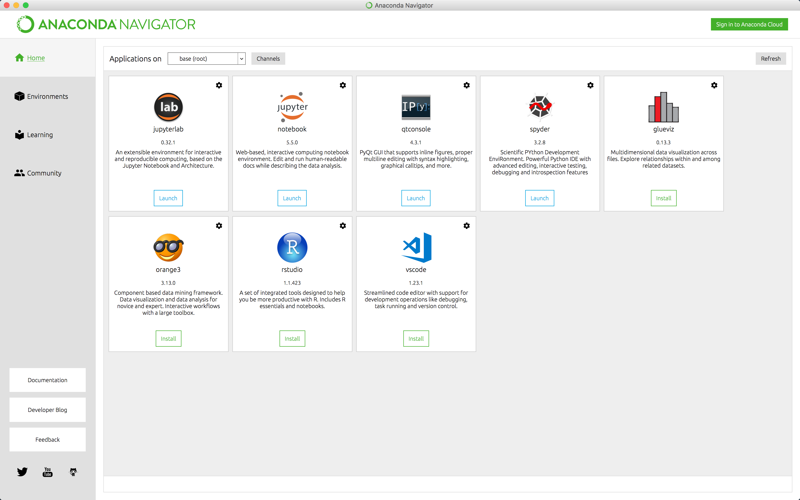
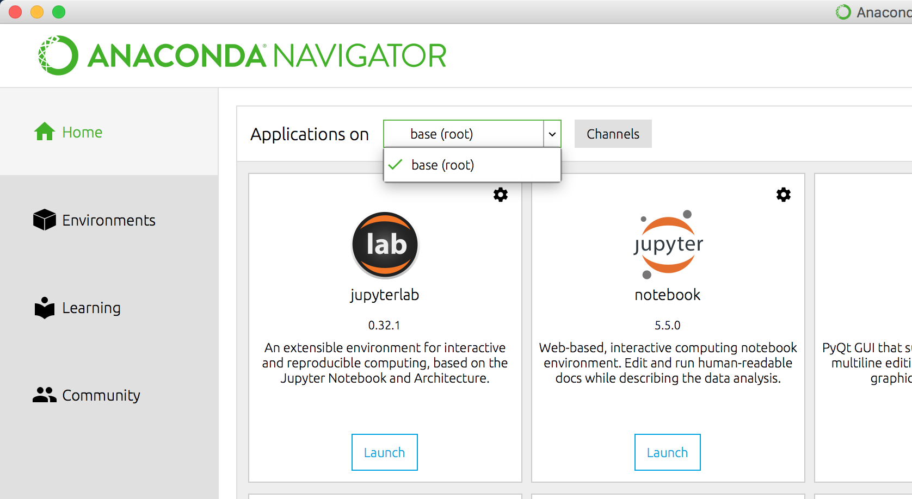

---

layout: ots-jupyter
title: Intro to Anaconda and Jupyter Notebooks

---

This chapter provides a brief introduction to conda, a package management system, and Jupyter Notebooks, which provide an easy and efficient way analyze data and communicate insights, all in one document.

Is it possible to do data science without these tools? Yes, absolutely. Nevertheless, we recommend that you give them a try for a few reasons: First, they are extremely popular, so it is almost certain that you will encounter them at some point in your career. Second, both are tailor made for the data science workflow. And third, they can make your first steps into data science a little easier.  

# Getting started with conda

### What is conda and why should you use it?

Conda is a package management system made with data scientists in mind, but what are packages? Packages are files containing function definitions and statements that can be imported into an active Python session to perform specific tasks. Many packages have been developed and shared by others that solve problems that we have as data scientists. For example, the NumPy, SciPy, and Pandas packages contain functions and data structures that can help us do things like linear algebra, machine learning, manipulate data frames, and perform time series analyses.

>__Note:__ Packages are typically called [modules](https://docs.python.org/3/tutorial/modules.html) by the Python community. We will continue to refer to "packages" in the present context since the topic at hand is the "package manager" conda. That said, in the other chapters we will maintain the Pythonic norm of calling them "modules".
 
If, for example, we need a random float between 0 and 1, we'll need to import the package `random` and use the function `random()`. Try entering the following into your console:

<div class = 'jupyter'>
```python
import random
random.random()
```
```python
0.9585919464556905
```
</div>

Many packages, like `random`, are bundled with the base Python distribution, but others need to be downloaded and installed, which is why we need a package manager. There are a number of pckage managers. For instance, [pip](https://pypi.org/project/pip/) is quite popular and is included in all Python binaries starting with Python 3.4. It's even installed with conda. We recommend conda to beginners for reasons that should become clearer below. That being said, you do not necessarily have to _choose_ one package manager over another. Each may have pros and cons depending on the circumstances, so use whatever works best for the task at hand.

### Downloading and installing conda

To get conda it's best to follow the system-specific instructions for [Windows](https://conda.io/docs/user-guide/install/windows.html), [macOS](https://conda.io/docs/user-guide/install/macos.html), or [Linux](https://conda.io/docs/user-guide/install/linux.html). There are two distributions to choose from: [Anaconda](https://www.anaconda.com/download) and [Miniconda](https://conda.io/miniconda.html), both of which can be downloaded in Python 2.7 or Python 3.6 versions. The Anaconda distribution is 3 GB in size and is considered to be the more "beginner friendly" alternative. It includes a graphical installer and a +100 useful packages to get you started. At 400 MB, Miniconda is a bare-bones affair, and includes a bash (command line) installer, conda, Python, and a handful of dependencies.      

### Creating environments and installing packages

The following instructions will guide you through the process of creating environments and installing packages, using both the conda GUI "Anaconda Navigator" and conda at the command line.

If you've downloaded the Anaconda distribution you can immediately open it by finding and clicking on its icon. If you've gone the Miniconda route, you'll first need to run `conda install -c anaconda anaconda-navigator` to install it. Once you've opened the Navigator you see the __Home__ tab, which displays a number of IDEs (integrated developmentenvironments) – including _Jupyter Notebook_, which we'll get to later:



The applications can either be installed, or launched if already installed. Above the applicatoins you'll see "Application on" and a drop-down menu. Open the menu and you you should see the `base (root)` environment:

 

Any environments you create will appear here, and the status "Install" vs. "Launch" will change for each application as you switch environments, depending on whether or not you've installed them in that environment.

## Next Chapter

All set with Python? On to the next chapter, [Data Structures in Python](data.html)
