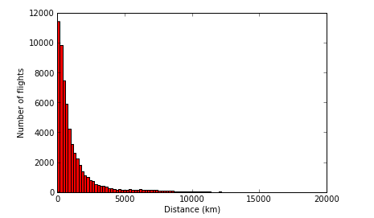

---

layout: ots
title: Reading and writing comma-separated data

---

Comma-separated values (CSV) is a way of expressing structured data in flat text files:

    "Coffee","Water","Milk","Icecream"
    "Espresso","No","No","No"
    "Long Black","Yes","No","No"
    "Flat White","No","Yes","No"
    "Cappuccino","No","Yes - Frothy","No"
    "Affogato","No","No","Yes"

It's a commonly used format to get data in and out of programs like Spreadsheet software, where the data is tabular.

Python comes with a [CSV module](http://docs.python.org/3/library/csv.html) which provides one way to easily work with CSV-delimited data:

Try downloading the [coffee.csv](../files/coffee.csv) file, which contains the rows shown above, and then run this program in IPython Notebook:

    import csv
    f=open("coffee.csv")
    for row in csv.reader(f):
        print(row)

Each row is read as a list of strings representing the fields in the row.

## Why not use .split()/.strip()?

We already a learned another way to do this, we've learned `split(",")` to split each row of text into comma-delimited fields, and then `strip()` to take off the quote marks.

There are a few good reasons to use the CSV module here:

* The csv module makes it clear what you're doing to anyone reading your code.
* The csv module is less likely to contain an error that splits some lines the wrong way.
* The csv module [has a lot of other features, documented here](http://docs.python.org/3/library/csv.html). These allow it to process differently formatted files, so you can easily update your program if the file format changes.

## Reading Airport data

We're going to do some processing of real-world data now, using freely available airline data sets from the [OpenFlights project](http://www.openflights.org/).

**TIP:** As we're moving on from radishes to aircraft, now is a good time to start a new notebook in IPython Notebook (under File->New) to keep everything organised. Don't forget to save your old notebook!

Visit the [OpenFlights data page](http://openflights.org/data.html) and download their airports data file - "airports.dat". This is a file in CSV format, open it in a text editor if you want to have a look at it.

## Challenge

Can you use this file to print all of the airport names for a particular country (say, Australia or Russia)?

To get you started, on the OpenFlights web page it shows that "Name" is the second field in each row of data. This means in the list of fields it will have index 1 (index 0 is the first field.)

Here's some code that prints the name of every airport:

    import csv
    f = open("airports.dat")
    for row in csv.reader(f):
        print(row[1])

Can you expand on that to only print airports for a certain country?

## Solution

    import csv
    f = open("airports.dat")
    for row in csv.reader(f):
        if row[3] == "Australia" or row[3] == "Russia":
            print(row[1])

## Bonus Challenge

How about writing a program that counts the number of airports in each country? This would be quite similar to the radishes problem we looked at back in the [Working with Strings](strings.md) chapter.

Suggestion: Use Edit->Copy to copy the radish counting program in IPython Notebook, and then modify it to work with the airport data.

# Airline Route Histogram

For our final piece of code, we're going to combine everything we've learned into a more complex problem to solve.

OpenFlights distribute databases for both airline locations and airline route details. You can download the routes database "routes.dat" from the [OpenFlights data page](http://www.openflights.org/data.html). This database stores every unique flight route that OpenFlights knows about. Take a moment to look at the fields available in the routes data (listed on the OpenFlights page.)

By using both data sources, we can calculate how far each route travels and then plot a [histogram](https://en.wikipedia.org/wiki/Histogram) showing the distribution of distances flown.

This a multiple stage problem:

* Read the airports file (airports.dat) and build a dictionary mapping the unique airport ID to the geographical coordinates (latitude & longitude.) This allows you to look up the location of each airport by its ID.

* Read the routes file (routes.dat) and get the IDs of the source and destination airports. Look up the latitude and longitude based on the ID. Using those coordinates, calculate the length of the route and append it to a list of all route lengths.

* Plot a histogram based on the route lengths, to show the distribution of different flight distances.

## Reading the airport database

Can you write code to read through "airports.dat" and create a dictionary mapping from an airport ID key (use the numeric ID in the first field) to the geographic coordinates? You may want to create two dictionaries, one holding latitudes and one holding longitudes.

Look back at the [OpenFlights data page](http://www.openflights.org/data.html) to see the fields available in the airports.dat file.

### Solution

    latitudes = {}
    longitudes = {}
    f = open("airports.dat")
    for row in csv.reader(f):
        airport_id = row[0]
        latitudes[airport_id] = float(row[6])
        longitudes[airport_id] = float(row[7])

In IPython Notebook, to see the contents of the latitudes or longitudes dictionaries, just type the variable name ("latitudes" or "longitudes") into a cell and run it.

</img>

If you're not using IPython Notebook, running this program won't print any output. Add a line `print(latitudes)` or `print(longitudes)` to the end of the program to print out the variable contents. It won't be as pretty as IPython Notebook, though!

There's one new thing in this example solution: `float(row[6])`. `float()` means to convert the string value to a floating point (ie fractional) number:

* The CSV module returns the latitude as a string like "-6.081689"
* You can convert this to an *integer number* (ie whole number) with `int(row[6])` but this would just be -6
* Floating point numbers can store fractions, so we convert it to a floating point number with `float(row[6])` and get the full number -6.081689

Storing the values as numbers rather than strings means you can use them for calculations later on.

## Route distances

Now we have the latitude & longitude of each airport we can calculate the distance of each airline route.

Calculating geographic distances is a bit tricky because the earth is a sphere. The distance we measure is the "[great circle distance](http://people.hofstra.edu/geotrans/eng/ch1en/conc1en/greatcircle.html)". We're not going to implement our own great circle distance function in Python here, instead you can [download a Python file with a geo_distance() function from here](../files/geo_distance.py). Feel free to read over it if you like, but don't worry about understanding it.

There are two ways you can use this function:

* Place the file in the Notebook working directory and then import it as a Python module to use it.

Here's an example to test everything is working:

    import geo_distance
    geo_distance.distance(-37.814,144.963,52.519,13.406) # Melbourne to Berlin in km!

In IPython Notebook, you can paste this code into a cell and Run it to see the distance.

If you're not using IPython Notebook, this code snippet doesn't display anything. You'll need to store the result of the `distance` function to a variable, then add a line with a `print()` statement to display the contents of the variable.

* As an laternative to the `import` statement, you can also copy and paste the contents of the geo_distance.py file into an IPython Notebook cell. Run the cell to define the `distance` function, and then use it in subsequent cells!

## Next Challenge

Once you have the `distance()` function working, can you write a program that reads all the airline routes from "routes.dat", looks up the latitude and longitude of the source and destination airports, and builds a list of route distances?

When looking at the list of fields in the OpenFlights data documentation, remember that we used the "Unique OpenFlights identifier" fields for each airport when we made the dictionaries of latitudes and longitudes, not the multi-letter airport codes.

**TIP:** You might come across an error like "KeyError: \\N" when you first run your program. This is another problem of 'dirty data', the "routes.dat" file contains some airports that aren't listed in "airports.dat". You can skip these routes by adding a test of the type `if airport in latitudes`. If you don't quite get what I mean, sneak a peek at the solution to see one way this could work.

## Solution

    distances = []
    f = open("routes.dat")
    for row in csv.reader(f):
        source_airport = row[3]
        dest_airport = row[5]
        if source_airport in latitudes and dest_airport in latitudes:
            source_lat = latitudes[source_airport]
            source_long = longitudes[source_airport]
            dest_lat = latitudes[dest_airport]
            dest_long = longitudes[dest_airport]
            distances.append(geo_distance.distance(source_lat,source_long,dest_lat,dest_long))

Once again, you can test the results of your program by typing the name of the output list (`distances` in this case) into an IPython Notebook cell and running it:

</img>

(If you're not using IPython Notebook, this is yet another program that doesn't display anything when it runs. Add `print()` statements to the end of the program to display the variable values.)

## Histogram

Now we're ready to create a histogram displaying the frequency of flights by distance.

    import numpy as np
    import matplotlib.pyplot as plt

    plt.hist(distances, 100, facecolor='r')
    plt.xlabel("Distance (km)")
    plt.ylabel("Number of flights")

</img>

`plt.hist()` does most of the work here. The first argument we supply is the dataset (list of distances.)

The second argument (100) is the number of bins to divide the histogram up into. You can increase this number to see more distinct bars and a more detailed picture, or reduce it to see a coarser picture. Try setting it to some other values and see what happens to the histogram plot.

The third argument, `facecolor`, sets the colour of the graph, "r" for red. There are a lot of ways to specify colours in matplotlib, [the documentation explains them all](http://matplotlib.org/api/colors_api.html).

The [full arguments available for hist() can be viewed in the matplotlib documentation](http://matplotlib.org/api/pyplot_api.html#matplotlib.pyplot.hist).

# Done

You've taken some real world data and graphed it in an informative way!

Granted, the results aren't earth shattering but you're well on your way to understanding the techniques to perform other data analysis, and chart other data. Congratulations!

If you're wondering what to look at next then there is some additional material on the [index page](../index.html) - both Extras chapters and some additional reference links.
