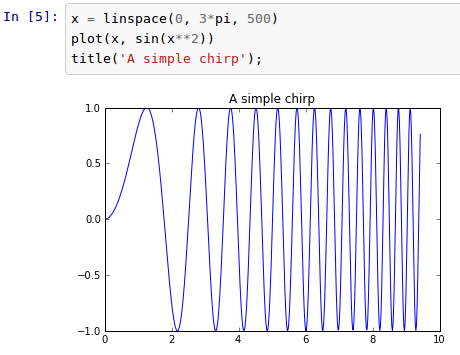
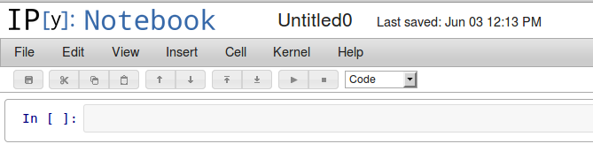
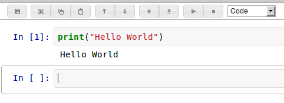
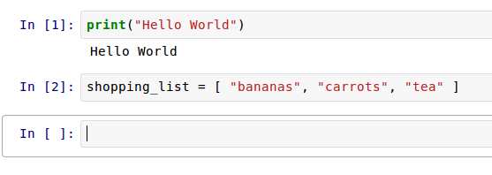
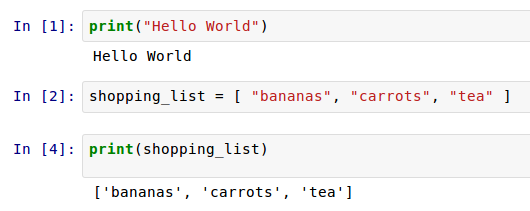

---

layout: ots
title: Introducing IPython Notebook

---

# IPython Notebok

Until now we've worked with Python either directly via the interactive Python console, or by writing Python programs using a text
editor.

However, there are other ways to work with Python. [IPython](http://ipython.org/) is a set of tools originally developed to make it easier for scientists to work with Python and data. It allows you to combine interactive Python exploration with prewritten programs and even text and equations for documentation.

</img>

# Installing IPython Notebook

There are a number of ways to install IPython Notebook. Many of these are bundled installers that install Pytho, IPython, and other useful Python libraries, such as *matplotlib* (a Python graphing library that integrates powerfully with IPython Notebook.)

We recommend you download and install [Anaconda](http://continuum.io/downloads.html), which is a free bundled installer of Python together with a number of other useful tools (including IPython Notebook.)

**Anaconda is a fairly large (~250Mb) download so if you're at a workshop event we'll have some USB keys with the predownloaded installers to save on bandwidth**

Anaconda comes with its own version of Python 2.7, IPython Notebook, other libraries like matplotlib, and a package manager ("conda") that you can use to install other packages or other Python versions.

## Alternative Options

**Skip this section if you're happy with Anaconda.**

Anaconda is pretty "kitchen sink" complete. There are some other installer options you can test out if you'd like to try something different:

* [winpython](http://code.google.com/p/winpython/) has installers for Windows, similar to Anaconda.

* [Pyzo](http://www.pyzo.org/downloads.html) has installers for Python 3 and bundled packages on Windows, Linux & OS X.

* If you have 'pip' installed (maybe from another OTS workshop) then you may be able to install IPython by itself (plus matplotlib) via 'pip', as follows:

      pip install tornado pyzmq numpy matplotlib ipython

(If you're on OS X you will need XCode installed for this to work.)

* If you're on Linux, most package managers include IPython Notebook. For instance on Ubuntu or Debian:

      sudo apt-get install ipython-notebook python-matplotlib

* If you can't get IPython Notebook to work on your computer at all, there's a hosted service called [Wakari](https://www.wakari.io/) that you can use for free. In this case your programs won't be running on your own computer, they'll be running "in the cloud" (ie on Wakari's servers somewhere else) and you'll just see the results in your web browser.

## Note about Python 3

Anaconda and some of the other installers come with Python version 2. You may have been using Python version 3 up until now, this is the verison that the Introduction to Programming workshop encourages you to use.

The Python world is slowly migrating towards using Python 3 for everything. IPython is available for both 2 & 3, but Anaconda comes with Python 2 as it includes some components which are still Python 2 only.

Python 2 and Python 3 have some minor incompatible differences in language syntax. The programs shown in this workshop are designed to work with both, but if you find some code that doesn't work (but perhaps works on your neighbour's computer) then this may be why.

## Starting IPython Notebook

You interact with IPython Notebook using your web browser. The Notebook program creates a "web server" locally on your computer that you then connect to.

To start IPython Notebook on Windows or OS X, there should be a clickable launcher under the Start menu (Windows) or in the Applications folder (OS X.)

Otherwise, you can start it from a command line terminal by running this command:

    ipython notebook --pylab inline
    
You should see some output like this:

    [NotebookApp] Using existing profile dir: u'/home/gus/.ipython/profile_default'
    [NotebookApp] Serving notebooks from /home/gus/workshops
    [NotebookApp] The IPython Notebook is running at: http://127.0.0.1:8888/
    [NotebookApp] Use Control-C to stop this server and shut down all kernels.

And a browser window may automatically open showing the IPython Notebook interface. If it doesn't open, you can copy-paste the "http" address from the output and paste it into your browser.

Even though you're interacting with IPython Notebook using your browser, Notebook is running right there on your computer in that window. Only you can access it.

## First Steps with Notebook

In your browser, click the "New Notebook" button and a new notebook will open up.

</img>

The empty box at the top is the first "cell" for entering Python code.

Try typing something like `print("Hello World")` into the cell. To run the code in the cell and see the output, click the Run button (play icon) on the toolbar, or type Shift-Enter:

</img>

You'll see that whenever you run a cell, a new cell appears where you can enter another set of Python statements. Try assigning a variable. Let's make another shopping list:

</img>

When you Run this cell you won't see any output, but behind the scenes the variable "shopping list" has been assigned.

We can see this by making a third cell to print the contents:

</img>

You can do anything with IPython Notebook cells that you'd do with normal Python code. As you build up the notebook full of cells you create a history of the things you've done and the results that were printed.

## Loading Notebook Files

You can also load IPython Notebooks that other people have created, saved as IPython Notebook files (File extension .ipynb.) Try [downloading and opening this Notebook file with the shopping list example](../files/shopping_list.ipynb). That Notebook contains some additional code, and some suggestions for changes you can make by going back and editing the existing files.

Take a few minutes to play with the same Notebook and see what it can do.

## Loading Python Files

You can also load a pre-existing Python file into an IPython Notebook cell by typing

    %load "myprogram.py"

and running it, which loads up a new cell containing the contents of *myprogram.py*.

Test this feature out by loading one of the scripts you wrote before. You may have to specify the full path to script file, depending on the directory IPython Notebook started up from.

There is one other useful built-in tool for working with Python files:

    %run "myprogram.py"

This will run *myprogram.py* and load the output into a Notebook cell.

## IPython Notebook Directory

When IPython Notebook starts up it prints a line like this:

    [NotebookApp] Serving notebooks from /home/gus/workshops

This is the directory that it was started from, and it's the working directory so if you type a line like `%run "myprogram.py"` it will look for the file "myprogram.py" in that directory.

It can be helpful to make sure this directory is the directory where you plan to keep files related to your work - otherwise you have to type the complete path to the file each time so Python can find it.

Installers like 'Anaconda' will add IPython Notebook to your system path, which means you can run it from any working directory. If you open a command line terminal and `cd` to the directory you want, you can then run `ipython notebook --pylab inline` to start IPython Notebook from inside the correct working directory.

## Other IPython tips

* As well as Shift-Enter there are other keyboard shortcuts in Notebook. Look under the Help menu -> Keyboard Shortcuts to see them all.

* In previous workshops we used `help()` to view help information in the Python interpreter. IPython Notebook makes this even simpler, you can just type the name of a Python function or module and end it with a `?`. Try it now, type `print?` into a cell and run it.

* Using a nifty tool called NBViewer you can easily share IPython Notebooks on the internet, rendered as web pages (but still downloadable to play with in IPython.) Check out the [NBViewer home page](http://nbviewer.ipython.org/) or the [IPython Notebook gallery](https://github.com/ipython/ipython/wiki/A-gallery-of-interesting-IPython-Notebooks) for some interesting starting points

## Next Chapter

Time to give Notebook a real workout! The next chapter is [Working With Text Files](text-files.html)
